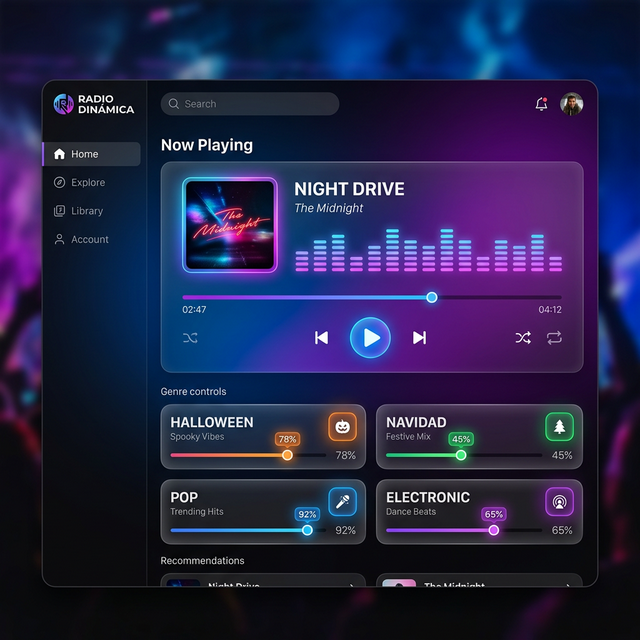

# 🎵 Radio Dinámica para OBS

Una aplicación web ligera para gestionar y reproducir música organizada por carpetas durante directos en OBS. Controla la probabilidad de reproducción de cada categoría en tiempo real, sin interrumpir la música.



## ✨ Características

- **Reproducción ininterrumpida**: Actualiza carpetas y porcentajes sin cortar la canción actual.
- **Categorías automáticas**: Detecta subcarpetas de tu directorio de música y crea sliders para cada una.
- **Probabilidades ajustables**: Cada categoría tiene un % que determina con qué frecuencia sonarán sus canciones.
- **Persistencia de configuración**: Los porcentajes se guardan automáticamente en `radio_config.json` vía un micro-servidor Node.js.
- **Compatible con OBS**: Diseñada para funcionar como fuente de navegador en OBS Studio.
- **Multiplataforma**: Funciona en Windows, Linux y macOS.
- **Híbrido Chrome/Firefox**: Usa `showDirectoryPicker` en Chrome/Edge (actualización silenciosa) y `webkitdirectory` en Firefox (fallback).

## 📁 Estructura del proyecto

```
radio-dinamica/
├── emisora_dinamica.html   # Aplicación principal (SPA)
├── server.js               # Micro-servidor Node.js (sin dependencias)
├── radio_config.json       # Se genera solo al mover sliders (persistencia)
├── README.md               # Este archivo
└── musica/                 # Tu carpeta de música (ejemplo)
    ├── Halloween/
    │   ├── cancion1.mp3
    │   └── cancion2.mp3
    ├── Navidad/
    │   ├── villancico1.mp3
    │   └── villancico2.mp3
    └── Pop/
        └── hit.mp3
```

## 🚀 Instalación y uso

### Requisitos
- [Node.js](https://nodejs.org/) (cualquier versión moderna)
- Un navegador moderno (Firefox, Chrome o Edge)

### Pasos

1. **Clona el repositorio:**
   ```bash
   git clone https://github.com/tu-usuario/radio-dinamica.git
   cd radio-dinamica
   ```

2. **Arranca el servidor:**
   ```bash
   node server.js
   ```
   Verás:
   ```
   🎵 Radio Dinámica en http://localhost:8080
   📄 Config: /ruta/radio_config.json
   ```

3. **Abre en tu navegador:**
   ```
   http://localhost:8080
   ```

4. **Selecciona tu carpeta de música** con el botón "Seleccionar Carpeta Raíz".

5. **Ajusta los porcentajes** de cada categoría y dale al ▶️ Play.

### Uso sin servidor (modo local)
Si no necesitas persistencia entre reinicios, puedes abrir `emisora_dinamica.html` directamente en el navegador (doble clic). Los porcentajes se guardarán en `localStorage` del navegador.

## 🐳 Docker

```dockerfile
FROM node:alpine
WORKDIR /app
COPY emisora_dinamica.html server.js ./
EXPOSE 8080
CMD ["node", "server.js"]
```

```yaml
# docker-compose.yml
services:
  radio:
    build: .
    ports:
      - "8080:8080"
    volumes:
      - ./radio_config.json:/app/radio_config.json
      - ./musica:/app/musica
```

> El volumen `radio_config.json` asegura que los porcentajes sobrevivan a reinicios del contenedor.

## 🎛️ Cómo funciona

### Flujo de reproducción
1. El usuario selecciona la carpeta raíz de música.
2. La app escanea recursivamente todas las subcarpetas.
3. Cada subcarpeta directa se convierte en una **categoría** con su propio slider (0–100%).
4. Al pulsar Play, se elige una categoría al azar ponderada por sus porcentajes.
5. De esa categoría se elige una canción al azar y se reproduce.
6. Al terminar, se repite el proceso automáticamente.

### Persistencia
- **Con servidor** (`node server.js`): cada cambio de slider envía un `POST /api/config` que escribe `radio_config.json` en disco. Al recargar, se lee con `GET /api/config`.
- **Sin servidor**: se usa `localStorage` del navegador (se pierde si se borra el perfil del navegador o el contenedor).

### Actualización en caliente
- **Chrome/Edge**: el botón "🔄 Actualizar" re-escanea la carpeta silenciosamente sin abrir diálogo.
- **Firefox**: se abre el selector de carpetas de nuevo (la música no se detiene).

## 🔧 API del servidor

| Método | Ruta | Descripción |
|--------|------|-------------|
| `GET` | `/api/config` | Devuelve el JSON de configuración actual |
| `POST` | `/api/config` | Guarda el JSON de configuración en disco |
| `GET` | `/*` | Sirve archivos estáticos (HTML, audio, etc.) |

## 📋 Formatos de audio soportados

`.mp3` · `.wav` · `.ogg` · `.m4a` · `.aac` · `.flac` · `.wma` · `.webm` · `.weba`

## 📄 Licencia

MIT
